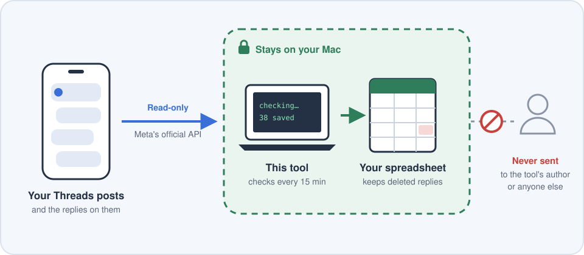

# Threads Reply Archiver

**Saves every reply on your Threads posts to a spreadsheet on your Mac, and keeps a copy even if a reply gets deleted.**

👤 **For:** creators whose comment sections get ugly and who want receipts.

🚫 **Never:** posts, deletes, or changes anything on your account. Never sends your data anywhere. Never asks for your password.

💻 **Mac only · Free · About 20 minutes to set up, one time.**

### ⬇️ [Download the latest version](https://github.com/lookitsevan/threads-reply-archiver/releases/latest)

> ⚖️ **Not affiliated with Meta or Threads. Use at your own risk.** By using this tool, you agree
> to follow Meta's terms. See **"Terms of use"** near the bottom.

> 🛡️ **Only download this from the original link.** If someone sends you a copy another way,
> don't run it. A changed copy could steal your key. See **"Check your download"** at the bottom.

---

## Where your data goes

<p align="center">
  
</p>

The tool talks to one place only: Meta. Your replies land in a spreadsheet on your own computer, and they stop there.

**Setup at a glance:** make a free Meta developer app → copy your key → put this folder in your home folder → double-click **Start**. Done.

---

## See an example first

> 🧪 **Everything in this example is made up.** The posts, accounts, and replies are fictional.
> No real person's data is shown here.

The example file shows what your spreadsheet looks like after the tool has been running for a bit:
**38 replies across 4 posts**. Open it here: **[examples/sample_archive.csv](examples/sample_archive.csv)**
(GitHub shows it as a table).

In the example, **@example_author** is the account owner (that would be **you**).
Every other `example_…` account is someone replying.

| Who replied | What happened | status | tag |
|---|---|---|---|
| @example_cafe_owner | Asked about custom prints. A business lead! | live | opportunity |
| @example_author | ↳ The owner replied to the lead. Your own replies are saved too. | live | |
| @example_troll | Posted a threat, then **deleted it**. The tool kept a copy. | **missing** | evidence |
| @example_angry_guy | Hostile reply the owner **hid**. Hidden replies are still saved. | live (hidden) | evidence |
| @example_snacker | Changed their reply after posting. The first version is kept too. | live (edited) | |
| @example_spam_bot | Spam that got removed. Kept, and marked missing. | **missing** | spam |
| *(no username)* | A reply from a **private account**. Meta hides who it is. | live | |
| @example_prankster | Posted a trick formula. The tool made it harmless. | live | |

---

## What's in the box

Every file is plain text. You can open any of them in TextEdit and read it before running anything.

| File | What it does | Size |
|---|---|---|
| **Start.command** | Sets everything up, then checks for replies every 15 minutes. Double-click to start. | 70 lines |
| **Open Archive.command** | Checks for new replies right now and opens your spreadsheet. | 5 lines |
| **Stop.command** | Turns off the 15-minute checks. Your saved replies stay. | 7 lines |
| **threads_archiver.py** | The actual tool. Talks to Meta, saves replies, and builds the spreadsheet. | 366 lines |
| **config.example.env** | A blank template where you'll paste your key. | 6 lines |
| **README.md** | This guide. | |
| **LICENSE** | Free to use, no warranty. | |

The download also includes an `examples` folder (the made-up sample spreadsheet) and a `docs` folder
(the diagram above). Neither one runs anything.

To remove it completely: double-click **Stop.command**, then delete the folder. Nothing else is left behind.

---

## Don't trust me. Check for yourself.

**What it asks Meta for (and nothing more):**
- `threads_basic`: see your own profile and your own posts.
- `threads_read_replies`: see the replies on your posts.

It does **not** ask to post, delete, hide replies, see your DMs, see your stats, or see anyone else's posts.
Meta shows you these exact permissions when you create your key.

🔒 For replies from **private accounts**, Meta hides the username and link, so those rows show up without them.

**The only website it talks to is Meta.** Check for yourself: open **Terminal**, paste this, and press Enter:

```
grep -rhoE "https?://[a-zA-Z0-9./_-]+" ~/ThreadsArchive --include="*.py" --include="*.command" | sort -u
```

You should see exactly these three lines:

```
http://www.apple.com/DTDs/PropertyList-1.0.dtd
https://graph.threads.net/refresh_access_token
https://graph.threads.net/v1.0
```

The two `graph.threads.net` lines are Meta's official Threads API. The `apple.com` line is only a
standard label inside Mac's scheduler file format. It is never visited.

**What it never does:**
- No account with me, no sign-up, no payment.
- Installs nothing. It uses the Python that comes with your Mac.
- Never asks for your password or admin access.
- Writes only inside its own folder, plus one small scheduler file that **Stop.command** removes.

**Your key stays locked down:**
- It lives only in `config.env` on your Mac, which only your user account can open.
- It's hidden from the tool's logs, so it never shows up in error messages.
- **You can cut it off anytime:** in Threads, go to **Settings → Account → Website permissions**
  and remove your app. The key stops working instantly.

**Make sure your copy is the real one:** see "Check your download" at the bottom.

---

## Part 1: Get your Threads key (about 15 min)

You'll make a free Meta developer app, add yourself as a tester, and copy a key. A key (Meta calls it a
"token") is like a password that lets this tool read replies on your posts.

<details><summary><b>▶ Show the steps</b></summary>

### Step 1: Make an app
1. Go to **developers.facebook.com** and log in with Facebook.
2. Click **My Apps**, then **Create App**.
3. When it asks what you want to do, choose **Access the Threads API**.
4. Give it any name, like "My Reply Archive," and finish.
5. Make sure the permissions **threads_basic** and **threads_read_replies** are turned on.

> ⚠️ You may see a page called **"Testing your use cases"** that says "Testing not started."
> **Ignore it.** You don't need it. It's only for apps that go public.

### Step 2: Add yourself as a tester
1. In the left sidebar, find **App roles**, then **Roles**.
   (If you don't see it, look under the ⚙️ gear icon.)
2. Click **Add People**.
3. Pick the role **Threads Tester**.
4. Type **your Threads username** and click **Add**.

### Step 3: Accept the invite on Threads
Do this **after** Step 2. The invite won't show up before then.
1. Open Threads (the app or threads.com).
2. Go to **Settings → Account → Website permissions → Invites**.
3. Tap **Accept**.
   (If it's not there yet, wait a minute and refresh.)

### Step 4: Make your token
1. Back on the Meta site, click the ✏️ **pencil icon** in the sidebar (Use cases).
2. Open **Access the Threads API**, then **Settings** (or **Customize**).
3. Scroll to **User Token Generator**.
4. Click **Generate Access Token** next to your name and say yes to the popup.
5. Copy the long code it shows you. **That's your token.**

> 🔒 **Treat your token like a password.** Don't text it, email it, or paste it into
> chats, AI tools, or shared docs. The only place it goes is the `config.env` file in Part 2.

</details>

---

## Part 2: Install the tool (about 5 min)

You'll move the folder into your home folder, double-click **Start**, and paste your key.

<details><summary><b>▶ Show the steps</b></summary>

### Step 1: Put the folder in the right place
Move this whole folder into your **home folder** and name it **ThreadsArchive**.
In Finder, press **Shift + Cmd + H** to open your home folder.

Don't put it on the Desktop, or in Documents, Downloads, or iCloud.
Your Mac blocks background tools from running there.

### Step 2: Run Start
1. Double-click **Start.command**.
2. If your Mac says it can't open it: **right-click** the file, choose **Open**, then **Open** again.
3. If a box pops up asking to install "Command Line Tools," click **Install**.
   When it finishes, double-click **Start.command** again.

### Step 3: Paste your token
1. The first time, a file called **config.env** opens.
2. Find the line that says `THREADS_ACCESS_TOKEN=paste_your_token_here`.
3. Replace `paste_your_token_here` with your token. No spaces, no quote marks.
4. Save it (**Cmd + S**) and close it.
5. Double-click **Start.command** one more time.

### Step 4: Watch it work
A black window shows what it's doing. It should look like this:

```
Contacting Threads...
Signed in as @yourname. Fetching posts from the last 30 days...
Found 12 posts. Checking replies...
  post 1/12: 8 replies
  post 2/12: 0 replies
  ...
Done. It now runs every 15 minutes while this Mac is awake.
```

The **data** folder opens when it's done. **You're all set.**

</details>

---

## Using it day to day

| File | What it does |
|---|---|
| **Open Archive.command** | Checks for new replies right now and opens your spreadsheet. |
| **Stop.command** | Pauses the 15-minute checks. Your saved replies stay safe. |
| **Start.command** | Turns the 15-minute checks back on. |

Your spreadsheet is `data/archive.csv` inside the folder. Use the **tag** and **notes** columns to mark
replies, like `evidence` or `opportunity`. Your tags are kept every time the tool updates.

<details><summary><b>▶ What each column means</b></summary>

Replies are **grouped by post**. The newest post is at the top.
Under each post, replies go from oldest to newest, so you can read the conversation in order.

The columns go left to right like this:

- **post_label**: the post's date and first few words. This tells you which post a reply belongs to.
- **post_text** and **post_permalink**: the full post and a link to it.
- **username** and **text**: who replied and what they said.
- **reply_type**: `reply to post`, or `↳ reply to @someone` if they answered another comment.
- **status**: `live` means it's still up. `missing` means it disappeared.
- **tag** and **notes**: **these are yours to fill in.** For example, tag replies `evidence` or `opportunity`.
- **edited**: says `yes` if they changed it. The first version is kept in **original_text**.
- The columns at the far right are IDs and timestamps. They're for proof. You can ignore them day to day.

Your tags and notes are kept every time the tool updates.
If you edit in Numbers or Excel, save it as a **CSV** with the **same name**.

**Tip: fold replies under each post in Numbers.** Click any cell in the **post_label** column,
then go to **Organize → Categories → Add Category for "post_label."** Each post becomes a
section you can open and close.

</details>

**Want to go back further in time?** Open **config.env** and change `LOOKBACK_DAYS=30` to a bigger
number, like `120`. The first run saves all the old replies on posts from that period, not just new ones.

---

## If something goes wrong

<details><summary><b>The black window sits still for more than 2 minutes</b></summary>

Press **Ctrl + C** to stop it. Then:
- **Using a VPN, Tailscale, or Cloudflare WARP?** Turn it off and try again.
  If that fixes it, the VPN was blocking the connection.
- Still stuck? [Open an issue](https://github.com/lookitsevan/threads-reply-archiver/issues/new/choose)
  with the last 10 lines of the window. **Check that your key isn't in there first.**

</details>

<details><summary><b>It says "0 posts checked"</b></summary>

You haven't posted in the last 30 days. Make `LOOKBACK_DAYS` bigger (see above).

</details>

<details><summary><b>It says "Token expired or revoked"</b></summary>

Make a new key (Part 1, Step 4) and paste it into **config.env**.
Normally this won't happen, because the tool renews your key by itself every week.

</details>

<details><summary><b>It says "This archive belongs to a different Threads account"</b></summary>

You're using a folder that someone else already set up.
Get a fresh copy from the [latest release](https://github.com/lookitsevan/threads-reply-archiver/releases/latest) and start over.

</details>

<details><summary><b>A file in data/raw/ is empty</b></summary>

That's normal. It only fills up when new or changed replies are found.

</details>

<details><summary><b>Good to know</b></summary>

- **It only runs while your Mac is awake.** If someone posts and deletes a reply while
  your Mac is asleep, the tool can't catch it.
- **"Missing" doesn't always mean deleted.** The person may have deleted it, Meta may
  have removed it, or their account may have gone private or blocked you.
- **Proof for serious threats:** the `data/raw/` folder keeps exact copies with a digital
  fingerprint (SHA-256) that shows nothing was changed. For real threats, also take your
  own screenshots, report them in the Threads app, and contact the police. Police can
  ask Meta to save records directly, even deleted ones.
- **Safety feature:** if a reply starts with `=`, the spreadsheet shows a `'` in front of it.
  This stops trick replies from running hidden commands in Excel or Numbers.

</details>

---

## Common questions

<details><summary><b>Why does my Mac warn me when I open it?</b></summary>

Apple charges developers $99 a year to "sign" their apps. This free tool isn't signed, so your Mac
says it doesn't know who made it. That's a warning about the *unknown*, not a sign that something is
harmful. Every file is plain text, so you can read them first. Then right-click → **Open** → **Open**.

</details>

<details><summary><b>Why do I need a Meta developer account?</b></summary>

Meta requires one for anyone using its official Threads API. It's free, and you're the only person
using your "app." It's just how Meta hands you a key to your own replies.

</details>

<details><summary><b>Can the author of this tool see my replies?</b></summary>

No. There's no server and no account with me. Everything stays on your Mac.
See "Where your data goes" and "Check for yourself" above.

</details>

<details><summary><b>Can I use this to watch someone else's account?</b></summary>

**No. This tool can't do that, and it isn't allowed to.**

**It's built only for your own account.** It saves the replies *you receive* on *your own* posts,
including back-and-forth conversations that happen under your posts. That's all.

**It can't be pointed at anyone else:**
- There's no setting to enter another person's username. The tool only works with the account
  that owns the key.
- Your key only unlocks *your* account. Meta's permissions don't allow it to read anyone
  else's posts, profile, followers, likes, or replies they leave on other people's posts.
- Someone who replies to you is only saved *as a reply on your post*. The tool never looks
  at their account.

**It isn't authorized for that either.** Using someone else's key, or setting this up on someone
else's account without their permission, breaks Meta's rules and may break the law where you
live. If a friend wants to use it, they should set it up on their own Mac with their own key.

**If you want to keep records of what other people post elsewhere, this is the wrong tool.
Please don't try to make it do that.**

</details>

<details><summary><b>Could this get my Threads account banned?</b></summary>

It uses Meta's official, permitted route and only *reads*. It never posts or automates anything
on your account. That said, Meta makes the rules, so there are no guarantees. See "Terms of use."

</details>

<details><summary><b>Is it legal to keep replies after people delete them?</b></summary>

It depends on where you live. For personal records and safety it's generally low-risk, but privacy
laws vary. See "Terms of use." This isn't legal advice.

</details>

<details><summary><b>Does it cost anything?</b></summary>

No. It's free, with no ads and no sign-up. The code is open for anyone to read.

</details>

<details><summary><b>Does it work on Windows, iPhone, or while my Mac is asleep?</b></summary>

Not right now. It's Mac-only, and it only checks while your Mac is awake.

</details>

<details><summary><b>What if Meta changes something and it stops working?</b></summary>

It will show an error in the black window. Your saved replies aren't lost.
Check the [latest release](https://github.com/lookitsevan/threads-reply-archiver/releases/latest) for updates.

</details>

<details><summary><b>Found a bug?</b></summary>

[Open an issue](https://github.com/lookitsevan/threads-reply-archiver/issues/new/choose).
**Never paste your key**, your `config.env` file, or other people's replies. Issues are public.
Security problems go through the private report on the **Security** tab instead.

</details>

---

## Why I made this

People I know, men and women alike, were getting flooded with replies that crossed the line:
threats aimed at them and at others in their comment sections, the kind of content that breaks
Meta's own rules. By the time they tried to report it, much of it had already been deleted,
and the proof went with it.

So I built something simple: a tool that keeps a record of every reply on your own posts, safely
on your own computer. That way, you have what you need to report abuse to Threads, and to the
police when it's serious.

It's free, I don't collect anything, and I never will.

— Evan ([@lookitsevan](https://www.threads.com/@lookitsevan))

---

## Terms of use (please read)

- **Not made by Meta.** This is an independent tool. It is not affiliated with,
  endorsed by, or supported by Meta or Threads. "Threads" and "Meta" are their trademarks.
- **You agree to Meta's rules, not just mine.** This tool uses Meta's official Threads API
  with your own developer app. By using it, you're responsible for following
  Meta's Platform Terms, Developer Policies, and the Threads Terms of Use.
- **Saving deleted replies is your choice and your responsibility.** This tool keeps copies
  of replies even after their authors delete them. Meta's terms and privacy laws where you
  live (or where your commenters live) may limit how long you can keep that data or what
  you can do with it. Check before you rely on it.
- **Keep what you collect private.** Replies belong to the people who wrote them. Don't
  publish, sell, or share the archive except with police, lawyers, or when the law allows.
- **Use at your own risk.** No warranty, no guarantees, and no liability for the author
  (see LICENSE). Nothing here is legal advice.

---

## Check your download (optional, but smart)
This makes sure nobody changed the file before it got to you.
1. Open **Terminal** (press **Cmd + Space**, type **Terminal**, and press Enter).
2. Type `shasum -a 256 ` (with a space at the end), then drag the **ThreadsArchive.zip** file into the window. Press Enter.
3. You'll see a long code. It should **exactly match** the code posted next to the download link.
   If it doesn't match, delete the file and don't run it.

---

*Free to use and share under the MIT License (see LICENSE). Provided as-is, with no warranty.
Not affiliated with Meta. You're responsible for following Meta's terms and the law,
and for how you use and store the replies you collect.*
